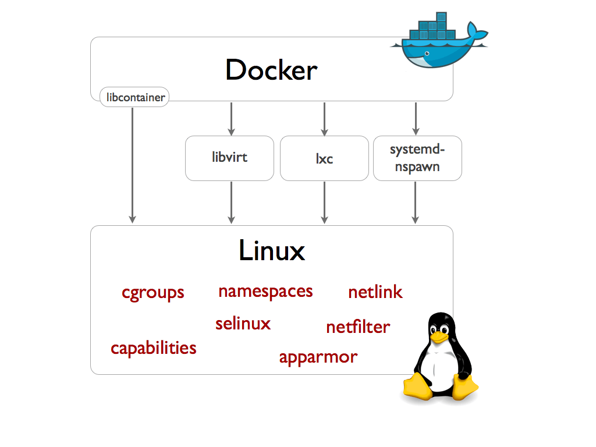

docker作为一个linux平台上一款轻量级虚拟化容器的管理引擎。在短短的两年内火得不得了。人人都在说docker。大大小小的容器summit。

docker的前景被普遍看好。最近恰好在研究docker。看了孙宏亮大牛的《docker源码解析》更是很有感触。于是我就在想，可不可以写一个学习

体会来做一个阶段性总结。我的想法就是如何从起名字的角度来阐释docker架构的一些内部原理。曾经有一位大牛导师给我说过这样几句话：

你给每个类起的名字代表了你对这个实现逻辑对最高理解。原话不记得了。但大体意思就是这样，这句话也成了我后来判断一个人代码质量的

重要依据。


docker架构图  此处。。。。。


Docker的总架构图就是这样。架构中主要有DockerClient、DockerDaemon、Docker Registry、Graph 、 Driver、libcontainer 以及Docker Container。


首先我们来看看DockerClient。这个名字很显然。是一个客户端。这时候你是不是联想到了命令、浏览器等等。不说了。


Docker Daemon。Daemon是守护的意思。读“滴萌”。前面说了client。那么就可能会联想到这应该是一个server。没错这个就是一个server。但docker的大牛们为什么不叫DockerServer呢？是有原因的。因为Daemon中不仅仅有server，还有其他的。还有Engine。这个Engine中有很多的job。DockerDaemon内部所有的任务都是由Engine中的一个个Job来完成。

事实上DockerDaemon就做两件事情：
* 接受并处理Docker Client发送的请求。
* 管理所有的docker容器。容器是个什么鬼后面会讲。

Docker Daemon 的架构主要由三部分：Docker Server、Engine 和 Job 。

Docker Server是走的http协议。你就姑且就把它理解为httpserver。ok？什么handler了。路由表啦都是标配。就是你常用的类似servlet那套。


Engine。一看名字就是很重要是不是。作为一个轻量级容器。自然要做很多的事情。这些事情由谁来做呢。就是由Engine来做。因为Engine手底下管理着众多的Job。那这么多的job是怎么进行管理的呢？在docker源码中，有个叫handlers的对象。你可以认为是一个map的数据结构。举例来说，有其中一项为｛“create”,daemon.ContainerCreate｝，就说明执行一个“create”的job的时候，执行的就是
daemon.ContainerCreate这个handler。这个设计思路是不是和前面说的server类似。其实就是一个路由或者叫映射。英文一般叫route或者map之类的。


engine做的比较有名的一件事情就是管理我们的容器。


Job

job你可以认为是docker中做事情的最小单元。每个action都是一个job。比如：在docker容器内部运行一个进程要创建一个job；创建一个容器，要创建一个job；在网络上下载一个文档，是一个job；创建一个server服务，这也是一个job。


有关job的接口设计与unix进程非常的像。比如说，job有自己名称、有运行时参数、有环境变量、有个标准输出，有标准错误以及返回状态等。

Job就像java中的runnable一样。runnable有run()。  Job也有自己的运行函数也叫Run()。


现在来看Docker Registry。

这个就是一个仓库。用来存储image的仓库。既然是仓库。你可能就会想到maven等等。自然有公用仓库，私有仓库。其中大家熟知的Docker Hub，就是是全球最大的共有仓库。用户也可以构建自己的私有仓库。在国内，也有很多的容器厂商为我们构建了公有仓库，比如daocloud、caicloud等等。真是为我们提供了极大的便利啊。


* Graph

```json
modern word-forming element meaning "instrument for recording; that which writes, marks, or describes; something written," from Greek -graphos "-writing, -writer" (as in autographos "written with one's own hand"), from graphe "writing, the art of writing, a writing," from graphein "to write, express by written characters," earlier "to draw, represent by lines drawn" (see -graphy). Adopted widely (Dutch -graaf, German -graph, French -graphe, Spanish -grafo). Related: -grapher; -graphic; -graphical.
```

从上面对graph的解释以及词源挖掘。我们发现，graph类似一个画板。你可以在上面写写画画。在graph上有很多个元素。比如有很多点等等。

所以你就能理解docker作者的苦心了。在docker中，graph负责管理所有的image，也就是镜像。这些image，你可以任性的组装叠加来构建出新的镜像。就好像你在画板上画了一层又一层。画了一个鸟，又画了一个鸭。这些鸟和鸭就是一个个image。既然是image，就得存储啊。在docker中，支持多种image的存储方式。比如：aufs、devicemapper、Btrfs等等。


＊Driver

现在来看看driver。这个太明显了。既然是一个容器。自然会有驱动了。你是不是已经在想什么网络、存储等等了。没错，这个感觉就对了。

docker现在为我们提供了Execution Drivers、graphdriver、networkdriver。

这些驱动都是为容器的运行环境提供服务的。

先来看看这个Execution Drivers。在0.9发布以后，Solomon Hykes 兴致勃勃的在docker官网写了一文，在那里介绍了Execution Drivers：

以下是那天他说的一些话：

Fellow Dockers,

Today we are happy to introduce Docker 0.9. 。。。。。。。blabla。。。。。

First, we are introducing an execution driver API which can be used to customize the execution environment surrounding each container. This allows Docker to take advantage of the numerous isolation tools available, each with their particular tradeoffs and install base: OpenVZ, systemd-nspawn, libvirt-lxc, libvirt-sandbox, qemu/kvm, BSD Jails, Solaris Zones, and even good old chroot. This is in addition to LXC, which will continue to be available as a driver of its own.

There are already several projects underway to develop more drivers. Want to join the fun? Come say hi on #docker-dev on Freenode, and we’ll help you get started.

大体就说自己很开心。说这个driver可以让docker利用多种隔离的工具。这个driver在当时是一个独立的子项目。在0.9之前是通过linux的lxc工具来管理容器的创建。现在我们可以使用这个driver来做这些事情。lxc我们还会继续支持。

与此同时我们还将会开发更多的driver。


比如接下来要介绍的networkdriver。


* libcontainer



Second, we are introducing a new built-in execution driver which is shipping alongside the LXC driver. This driver is based on libcontainer, a pure Go library which we developed to access the kernel’s container APIs directly, without any other dependencies.

Thanks to libcontainer, Docker out of the box can now manipulate namespaces, control groups, capabilities, apparmor profiles, network interfaces and firewalling rules – all in a consistent and predictable way, and without depending on LXC or any other userland package. This drastically reduces the number of moving parts, and insulates Docker from the side-effects introduced across versions and distributions of LXC. In fact, libcontainer delivered such a boost to stability that we decided to make it the default. In other words, as of Docker 0.9, LXC is now optional. To switch back to the LXC driver, simply restart the Docker daemon with docker -d -e lxc. Of course we will continue to support the LXC driver going forward.
