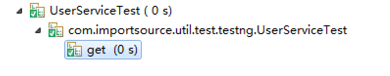

 TestNG的亮点之一就是Groups。这个在新增加功能以后，只对check-in-function进行测试。就可以用分组来做。
 
#Groups

TestNG allows you to perform sophisticated groupings of test methods. Not only can you declare that methods belong to groups, but you can also specify groups that contain other groups. Then TestNG can be invoked and asked to include a certain set of groups (or regular expressions) while excluding another set.  This gives you maximum flexibility in how you partition your tests and doesn't require you to recompile anything if you want to run two different sets of tests back to back.

Groups are specified in your testng.xml file and can be found either under the <test> or <suite> tag. Groups specified in the <suite> tag apply to all the <test> tags underneath. Note that groups are accumulative in these tags: if you specify group "a" in <suite> and "b" in <test>, then both "a" and "b" will be included.

For example, it is quite common to have at least two categories of tests

* Check-in tests.  **These tests should be run before you submit new code.**  They should typically be fast and just make sure no basic functionality was broken.
 
* Functional tests.  These tests should cover all the functionalities of your software and be run at least once a day, although ideally you would want to run them continuously.

Typically, check-in tests are a subset of functional tests.  TestNG allows you to specify this in a very intuitive way with test groups.  For example, you could structure your test by saying that your entire test class belongs to the "functest" group, and additionally that a couple of methods belong to the group "checkintest":

##TestClz
```java
public class UserServiceTest {
  @Test(groups = { "functest", "checkintest" })
  public void get() {
  }
 
  @Test(groups = {"functest"} )
  public void del() {
  }
 
  @Test(groups = { "functest" })
  public void list() {
  }
  
  @Test(groups = { "functest" })
  public void save() {
  }
}
```

##Conf
```xml
<test name="UserServiceTest">
		<groups>
			<run>
				<include name="checkintest" />
			</run>
		</groups>
		<classes>
			<class name="com.importsource.util.test.testng.UserServiceTest" />
		</classes>
	</test>
```

##Result



#Method groups

你可以通过include和exclude进行过滤方法。

```xml
<test name="Test1">
  <classes>
    <class name="example1.Test1">
      <methods>
        <include name=".*enabledTestMethod.*"/>
        <exclude name=".*brokenTestMethod.*"/>
      </methods>
     </class>
  </classes>
</test>

```
